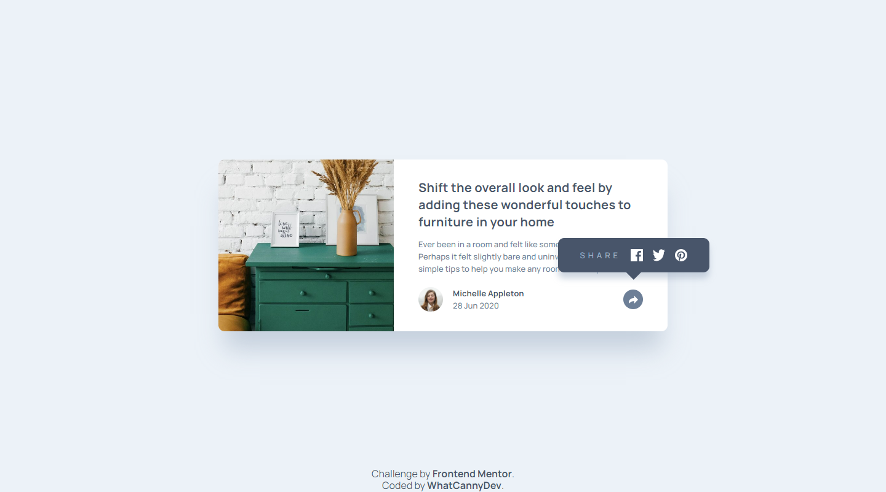

# Frontend Mentor - Article preview component solution

This is a solution to the [Article preview component challenge on Frontend Mentor](https://www.frontendmentor.io/challenges/article-preview-component-dYBN_pYFT). Frontend Mentor challenges help you improve your coding skills by building realistic projects. 

## Table of contents

- [Overview](#overview)
  - [The challenge](#the-challenge)
  - [Screenshot](#screenshot)
  - [Links](#links)
- [My process](#my-process)
  - [Built with](#built-with)
  - [What I learned](#what-i-learned)
  - [Useful resources](#useful-resources)
- [Author](#author)


## Overview

### The challenge

Your challenge is to build out this article preview component and get it looking as close to the design as possible.

You can use any tools you like to help you complete the challenge. So if you've got something you'd like to practice, feel free to give it a go.

The only JavaScript you'll need for this challenge is to initiate the share options when someone clicks the share icon.

Users should be able to:

- View the optimal layout for the component depending on their device's screen size
- See the social media share links when they click the share icon

### Screenshot



### Links

- Solution Repository URL: [Click here](https://github.com/CannyRo/FrontendMentor_ArticlePreviewComponent8dYBN_pYFT)
- Live Site URL: [Click here](https://cannyro.github.io/FrontendMentor_ArticlePreviewComponent8dYBN_pYFT/)

## My process

### Built with

- Semantic HTML5 markup
- CSS custom properties
- Flexbox
- CSS Grid
- Mobile-first workflow

### What I learned

How to create this modal/menu system that appears and disappears using only Html and CSS, i.e. without any use of Javascript.

All you need is a checkbox input and CSS selectors with :checked and :has ; to see how does it, see below:

```html
<div class="container">
  <input type="checkbox" name="openMenu" id="openMenu" title="Share this article" class="myInput">
  <div class="menu">
    <button>Button 01</button>
    <button>Button 02</button>
    <button>Button 03</button>
  </div>
</div>
```
```css
.container {
  position: relative;
  width: 100%;
  height: auto;
}
.myInput {
  appearance: none; 
  /* Eraze the input style and let you all the liberty 
  to styling it as you want */
  /* ... */
}
.menu {
  display: flex;
  /* ... */
  /* Styling menu */
  /* ... */
}
.container > .menu {
    display: none;
}
.container:has( > .myInput:checked ) > .menu {
    display: flex;
}
```


### Useful resources

- [How drawing a triangle or any shape ?](https://developer.mozilla.org/en-US/docs/Web/CSS/clip-path) - This helped me to draw a triangle to compose the "bubble".

## Author

- Website - [WhatCannyDev is searching a work-study contract in France](https://cannyro.github.io/hire_mr_canny/en)
- Frontend Mentor - [@CannyRo](https://www.frontendmentor.io/profile/CannyRo)
- GitHub - [@CannyRo](https://github.com/CannyRo)
- LinkedIn - [Ronan CANNY](https://www.linkedin.com/in/ronan-canny-b29443277/)
